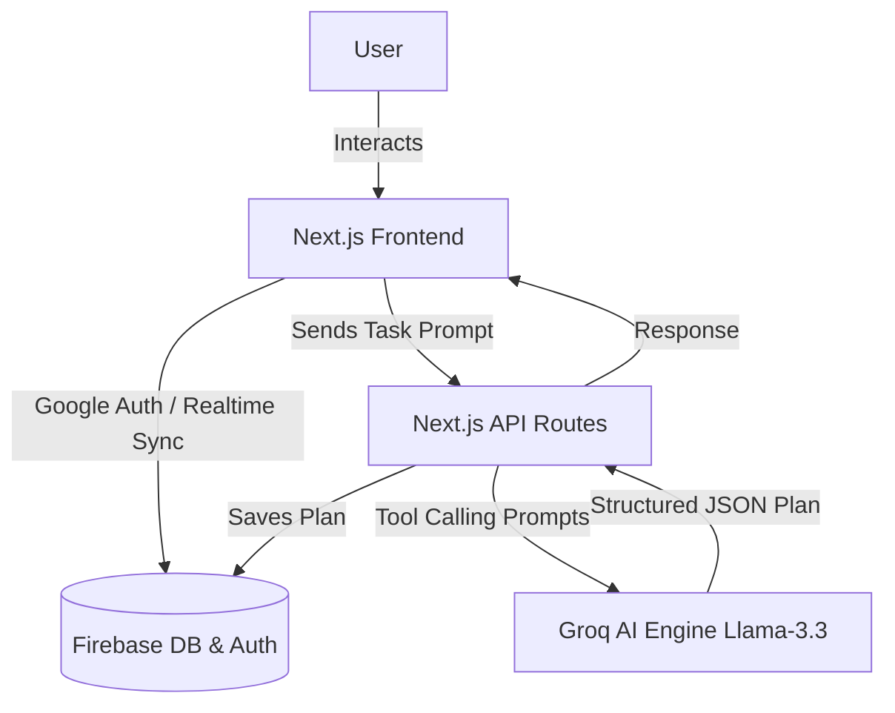
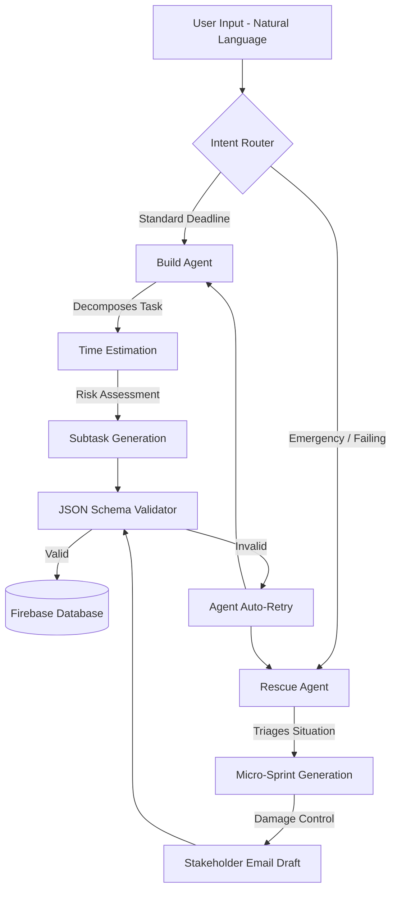
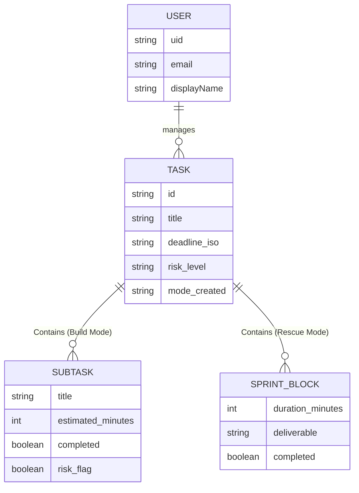

# ARIA - Architecture Documentation

This document contains the system architecture for ARIA (Autonomous Rescue & Intervention Agent). You can use the **Mermaid diagrams** directly in your GitHub README or Google Doc, or copy the **Eraser.io Prompts** into [Eraser.io](https://www.eraser.io/) to generate highly professional, presentation-ready diagrams for your hackathon submission.

---

## 1. High-Level System Architecture

This diagram shows how the user interacts with the Next.js frontend, which routes requests to the Next.js API backend, communicates with Firebase for state, and utilizes the Groq AI Engine for agentic reasoning.

### Eraser.io Syntax (Diagram-as-Code)
Copy and paste this into an Eraser.io file:

```eraser
// ARIA High Level Architecture
User [icon: user, color: blue]
Next.js Frontend [icon: react, color: cyan] {
  Auth Context
  Dashboard View
  Task View
}
Next.js API Routes [icon: server, color: gray] {
  /api/aria/build
  /api/aria/rescue
}
Firebase [icon: firebase, color: orange] {
  Authentication
  Realtime Database
}
Groq AI Engine [icon: cpu, color: red] {
  Llama-3.3-70b-versatile
  Structured Tool Calling
}

User > Next.js Frontend : Interacts with UI
Next.js Frontend > Firebase : Authenticates (Google Auth)
Next.js Frontend > Firebase : Reads/Updates Tasks Realtime
Next.js Frontend > Next.js API Routes : Sends Task Requests
Next.js API Routes > Groq AI Engine : Submits Agentic Prompts
Groq AI Engine > Next.js API Routes : Returns JSON Execution Plan
Next.js API Routes > Firebase : Saves Generated Plan to DB
Next.js API Routes > Next.js Frontend : Returns Success Response
```

### Mermaid Diagram


---

## 2. Agentic Workflow (Build & Rescue Modes)

This diagram details the decision-making process of the ARIA AI Agents. It outlines how unstructured natural language is transformed into a highly structured, risk-assessed execution plan.

### Eraser.io Syntax (Diagram-as-Code)
Copy and paste this into an Eraser.io file:

```eraser
// ARIA Agentic Workflow
User Input [icon: text, color: gray]
Intent Router [icon: git-merge, color: purple]
Build Agent [icon: zap, color: yellow] {
  Decomposes Task
  Estimates Time
  Flags Subtask Risks
}
Rescue Agent [icon: alert-triangle, color: red] {
  Triages Emergency
  Builds Sprint Blocks
  Drafts Stakeholder Email
}
Schema Validator [icon: check-circle, color: green]
Firebase DB [icon: database, color: orange]

User Input > Intent Router : Natural Language Task + Deadline
Intent Router > Build Agent : Standard Task
Intent Router > Rescue Agent : Urgent / Failing Task
Build Agent > Schema Validator : Outputs JSON Plan
Rescue Agent > Schema Validator : Outputs JSON Rescue Plan
Schema Validator > Firebase DB : Persists Validated Plan
```

### Mermaid Diagram


---

## 3. Database Schema (Firebase Realtime DB)

This diagram shows how data is structured within the Firebase Realtime Database.

### Eraser.io Syntax (Diagram-as-Code)
Copy and paste this into an Eraser.io file:

```eraser
// ARIA Database Schema
User [icon: user] {
  uid: string
  email: string
  displayName: string
}

Task [icon: file-text] {
  id: string
  title: string
  description: string
  deadline_iso: string
  risk_level: string (LOW, MEDIUM, HIGH, CRITICAL)
  mode_created: string (BUILD, RESCUE)
  status: string (active, completed)
}

Subtask [icon: check-square] {
  title: string
  estimated_minutes: number
  completed: boolean
  risk_flag: boolean
}

SprintBlock [icon: fast-forward] {
  block_number: number
  duration_minutes: number
  deliverable: string
  completed: boolean
}

User - Task : has many >
Task - Subtask : contains (if BUILD) >
Task - SprintBlock : contains (if RESCUE) >
```

### Mermaid Diagram

