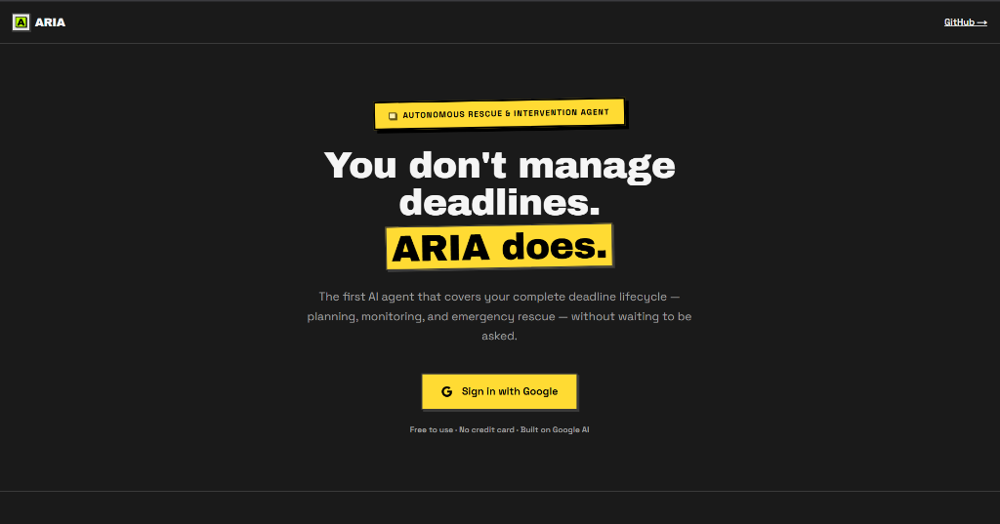
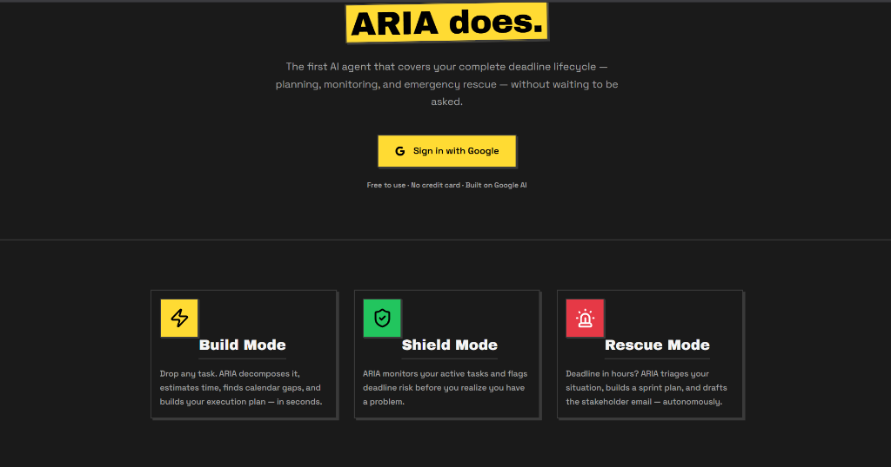
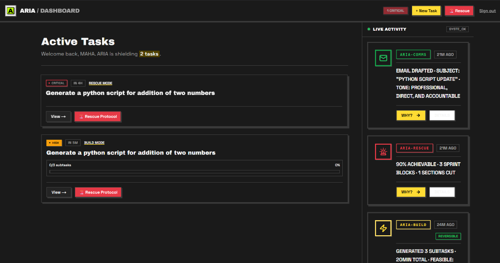
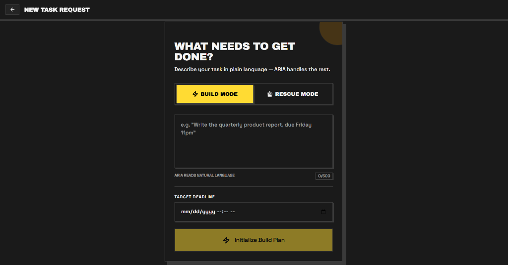
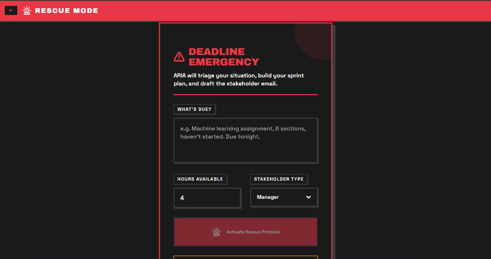
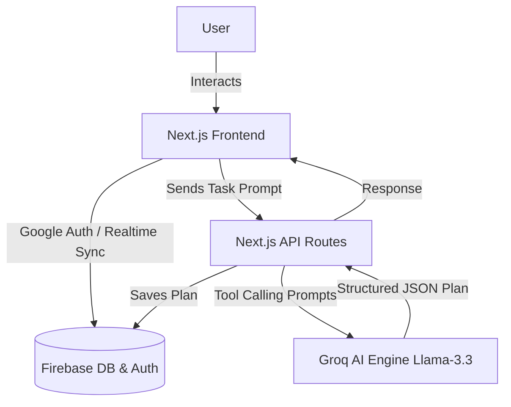
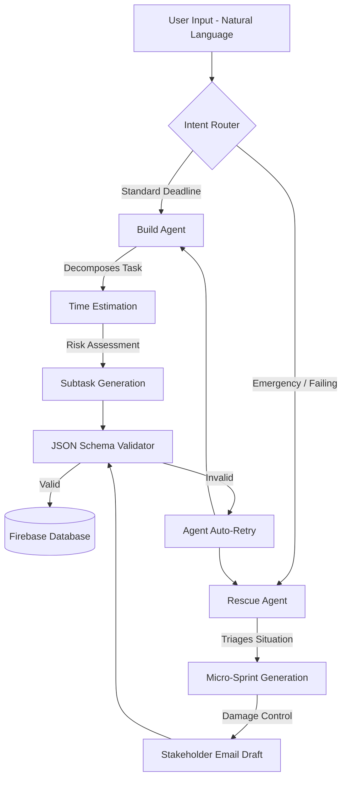
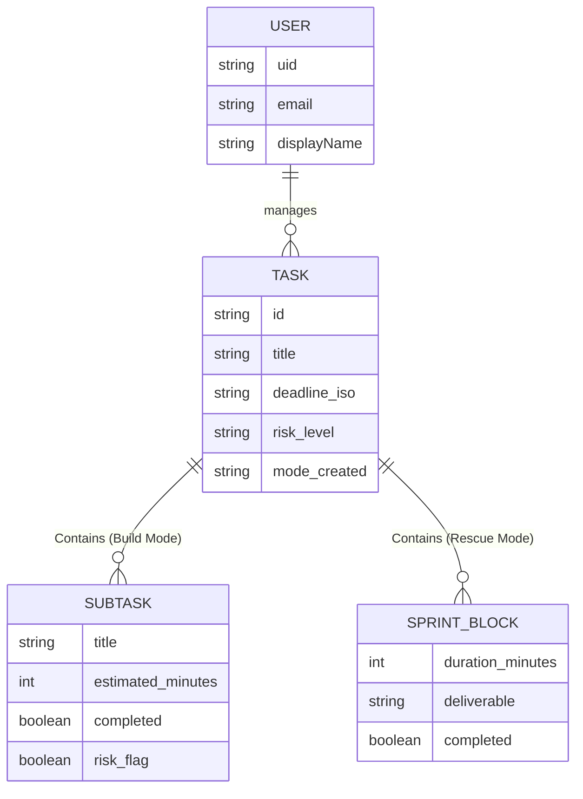

# ARIA (Autonomous Rescue & Intervention Agent)

> **You don't manage deadlines. ARIA does.**

ARIA is the first AI agent that covers your complete deadline lifecycle — planning, monitoring, and emergency rescue — without waiting to be asked. Built for the **Vibe2Ship 2026 Hackathon**.

## Features

- **⚡ Build Mode:** Drop any task in natural language. ARIA decomposes it, estimates time, flags risks, and builds your execution plan in seconds.
- **🛡️ Shield Mode:** ARIA autonomously monitors your active tasks and flags deadline risks before you realize you have a problem.
- **🚨 Rescue Mode:** Deadline in hours? Haven't started? ARIA triages your situation, builds a micro-sprint plan, cuts scope, and drafts your stakeholder apology email.

## Previews

### Dashboard
*Central command for monitoring task health and active risks.*

### Build Mode
*Natural language task decomposition and planning.*

### Rescue Protocol
*Emergency triage for failing tasks.*

---

## Architecture

ARIA is built with a modern, agentic architecture powered by **Next.js**, **Firebase**, and **Groq (Llama 3.3)**.

### 1. High-Level System Architecture

### 2. Agentic Workflow

### 3. Database Schema

## Tech Stack
- **Frontend Framework:** Next.js 14 (App Router)
- **Styling:** Tailwind CSS (Neobrutalist Design System)
- **Database & Auth:** Firebase (Realtime Database & Google Auth)
- **AI Engine:** Groq Cloud API (Llama-3.3-70b-versatile)
- **Deployment:** Vercel (Recommended)

## Getting Started

1. Clone the repository
2. Install dependencies: `npm install`
3. Setup your `.env.local` with Firebase credentials and your `GROQ_API_KEY`.
4. Run the development server: `npm run dev`
5. Open [http://localhost:3000](http://localhost:3000)

---
*Developed for Vibe2Ship 2026*
